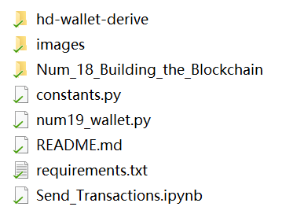
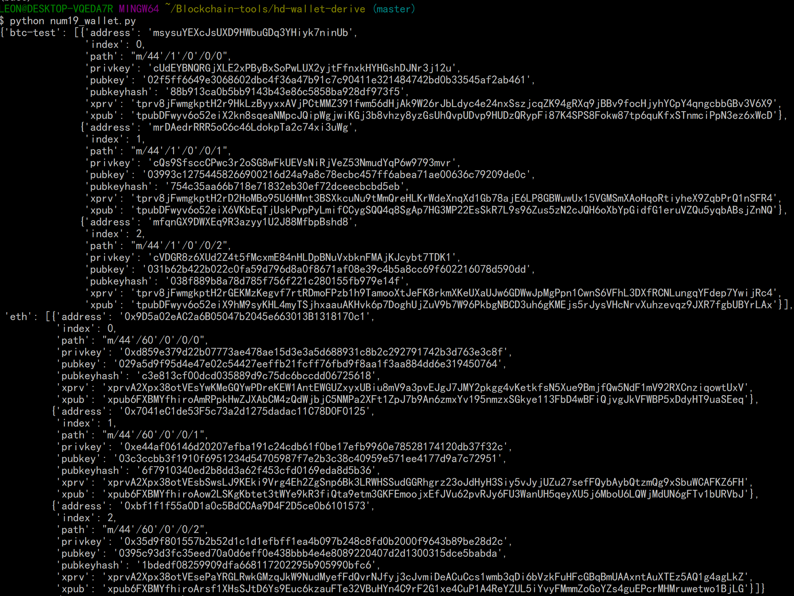
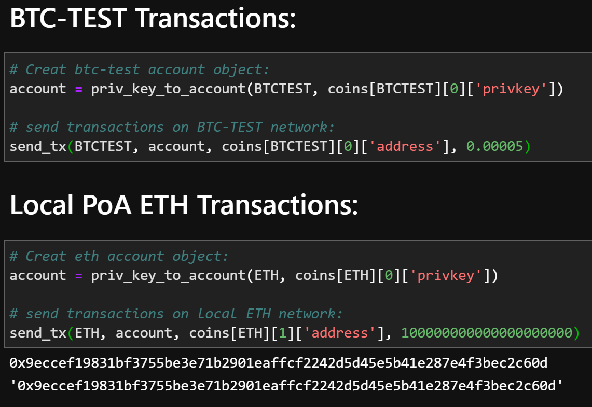
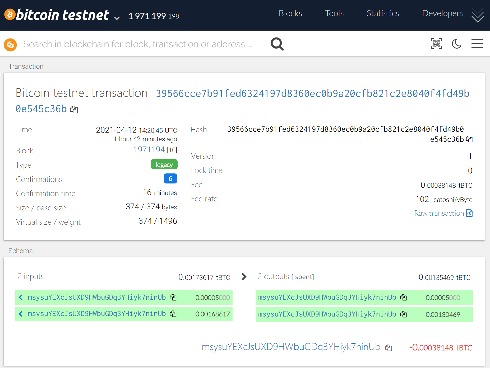
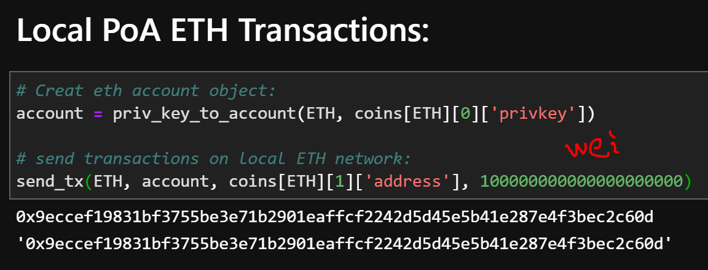
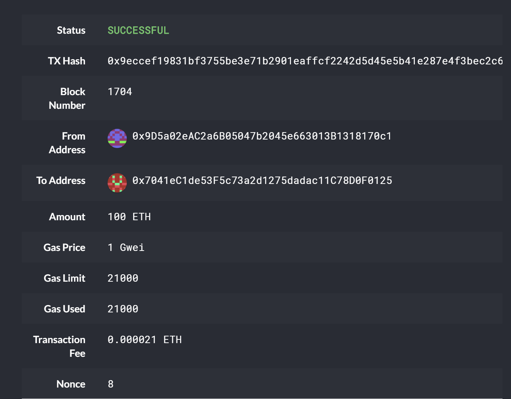

# Multi-Blockchain Wallet in Python

## PHP Install Guide
PHP must be installed on your operating system (any version, 5 or 7, not version8). Don't worry, you will *not* need to know any PHP.

The `hd-wallet-derive` library is written in the PHP language; therefore, you will be required to first set up PHP on your machines before installing and then running the `hd-wallet-derive` library.

**Environment Setup in Microsoft Windows Operating System:**

For those with a **Windows operating system**, execute the following steps:

1. Windows machines do not come with a pre-built PHP and Apache Web Server, and therefore will require both. Luckily, some installers bundle these two together! Visit the [XAMPP website](https://www.apachefriends.org/index.html) and download the installer for Windows; the XAMPP is a popular PHP development environment that is easy to install and configure. Be sure to download version 7, as version 8 can cause issues with the `hd-wallet-derive` library.

2. Use the XAMPP package to install PHP and its associated dependencies. Keep the defaults for now unless there is a dependency conflict.

3. Then, once the XAMPP package is installed, navigate to the folder where the PHP binaries are located. This should be at `C:\xampp\php`.

4. Edit the `php.ini` file (`C:\xampp\php\php.ini`) using Notepad and add the following line at the end of the file: `extension=php_gmp.dll`. This will enable a necessary PHP extension that `hd-wallet-derive` relies on.

5. Next, you need to update the System Environment Variables and add the path containing the PHP binaries (`C:\xampp\php`) to the `PATH` environment variable.

6. For this particular step, we will use the Windows Command Prompt as Administrator as follows: 

      * In the Cortana search field, type in CMD; you will see the Command Prompt application in the search results, choose the "Run as administrator" option to continue.

      * You will be asked if you want the Command Prompt to make changes in your system, click on the "Yes" button to continue.

      * You will be able to run commands as administrator if you see the title `Administrator: Command Prompt` in the window. In the administrator's prompt, it’ll say `Administrator`, while other prompts will not.

7. In this new terminal, type the following command to update the `PATH` system variable.

    ```shell
    setx /M PATH "%PATH%;C:\xampp\php"
    ```

8. If everything was successful, you will see a confirmation message.

9. Test that the newest version of PHP is working. Close all the terminal windows (`git-bash` and Windows Command Prompt), open a new `git-bash` terminal windows, and execute the following command.

    ```shell
    php -version
    ```

## HD-Wallet-Derive Install Guide

With the latest version of PHP installed on our machines, we can now proceed to the installation of the `hd-wallet-derive` library.

**Installation:**

1. Begin by opening a fresh terminal. Windows users **must** open their terminal as administator as follows:

    * Input `C:\Program Files\Git\bin\bash.exe` directly into the system search bar and launch the program as _Administrator_ from the resulting menu. 
    
    * **This step is required or the installation will fail!**

2. With your terminal open as indicated for your operating system, cd into your `Blockchain-Tools folder and run the following code:

    ```shell
      git clone https://github.com/dan-da/hd-wallet-derive
      cd hd-wallet-derive
      curl https://getcomposer.org/installer -o installer.php
      php installer.php
      php composer.phar install
    ```

3. You should now have a folder called `hd-wallet-derive` containing the PHP library!


**Verification:**

1. Run the command to `cd` in your `hd-wallet-derive` folder.

2. Once you've confirmed your are in your `hd-wallet-derive` folder, execute the following command:

    ```shell
    ./hd-wallet-derive.php -g --key=xprv9tyUQV64JT5qs3RSTJkXCWKMyUgoQp7F3hA1xzG6ZGu6u6Q9VMNjGr67Lctvy5P8oyaYAL9CAWrUE9i6GoNMKUga5biW6Hx4tws2six3b9c --numderive=3 --preset=bitcoincore --cols=path,address --path-change
    ```


## Other Dependencies
installation via: requirements.txt

- [`bit`](https://ofek.github.io/bit/) Python Bitcoin library.

- [`web3.py`](https://github.com/ethereum/web3.py) Python Ethereum library.

## Files:
Following files are required:

 


## Project Instructions

### Generate a Mnemonic

- Generate a new 12-word mnemonic using `hd-wallet-derive` or by using [this tool](https://iancoleman.io/bip39/).

- Set this mnemonic as an environment variable, and include the one you generated as a fallback, using:
  `mnemonic = os.getenv('MNEMONIC', 'insert mnemonic here')`


### STEP 1：Derive Wallets
**run num19_wallet.py Python file in Terminal as Admin**

 

Then you should now be able to select child accounts (and thus, private keys) by calling coins[COINTYPE][INDEX]['privkey'].


### STEP 2：Fund Derived Accounts and Set Up Local PoA Network for ETH

**Bitcoin Faucet:**
https://bitcoinfaucet.uo1.net/send.php
https://kuttler.eu/en/bitcoin/btc/faucet/success/
https://testnet-faucet.mempool.co/

**Local PoA Network:**
Please refer the [Num_18_Building_the_Blockchain](https://github.com/leongaoleon/Assignments_Peng_Gao.git)
You will need to start two nodes to start the local network for ETH.

OR you might visit the Num_18_Building_the_Blockchain folder for quicker access.


### STEP3: Sending Transactions:
**run Send_Transactions.ipynb**



Due to a bug in `web3.py`, you will need to send a transaction or two with MyCrypto first, since the
`w3.eth.generateGasPrice()` function does not work with an empty chain. You can use one of the `ETH` address `privkey`,
or one of the `node` keystore files.


### STEP4: Checking Transaction Results:

#### BTC-Test:

Use a [block explorer](https://tbtc.bitaps.com/) to watch transactions on the address.


**The confirmation shows about 0.00005 BTC has been sent from derived BTC account_one to account_two.**


#### ETH:

**Note: the unit used is Wei, whereas MyCrypto is using ETH.**



**The confirmation shows about 100 ETH has been sent from derived ETH account_one to account_two.**


