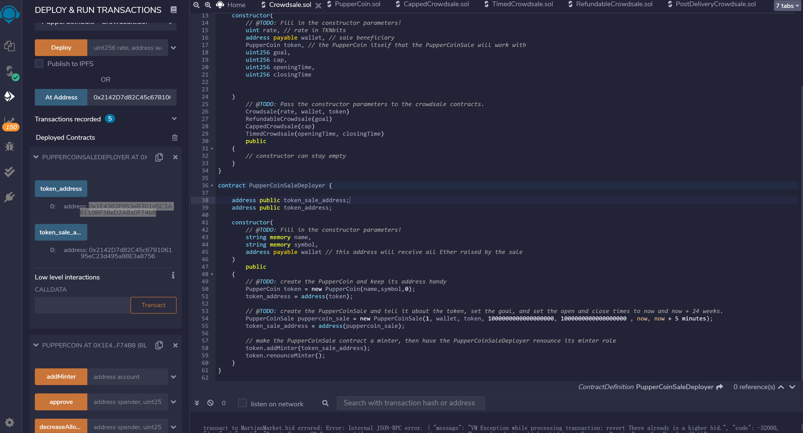
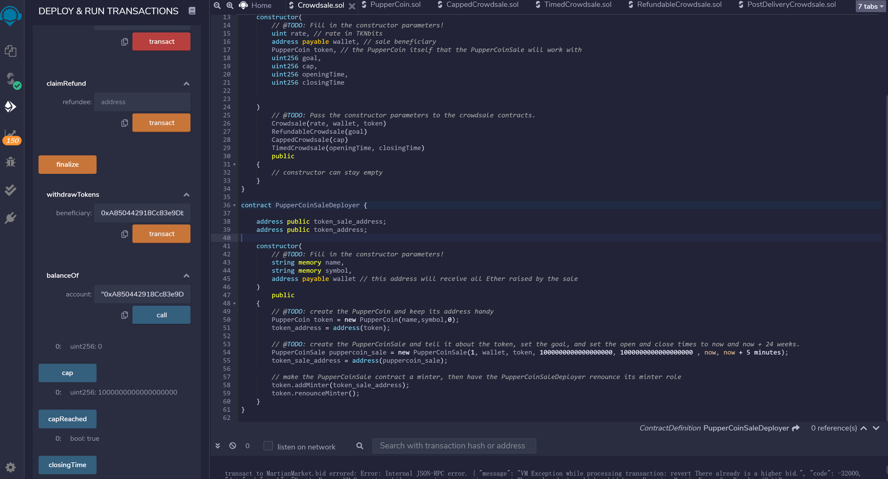
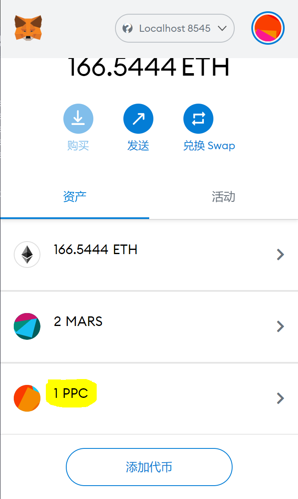
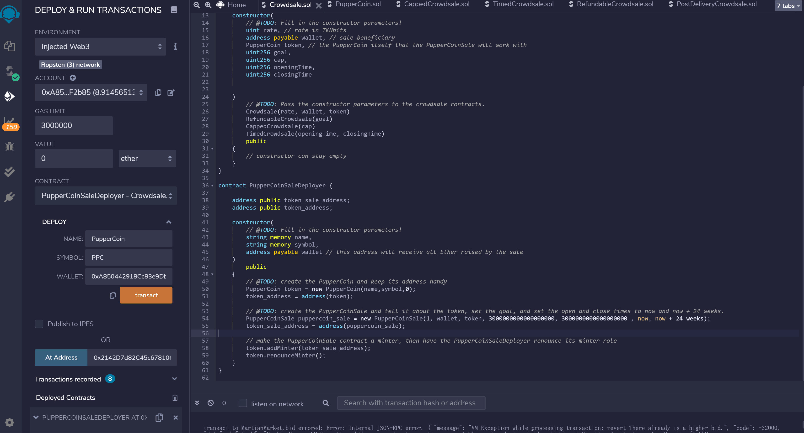
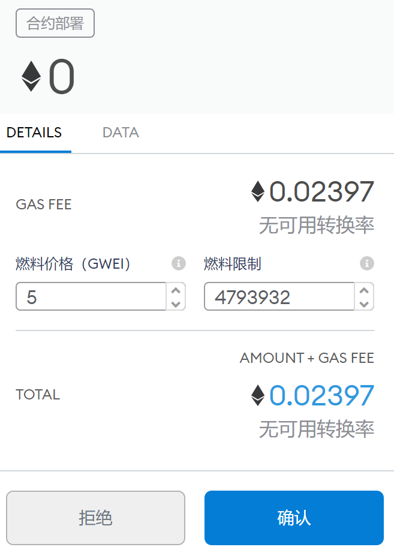

# Creating Advanced Solidity Contract -- CrowdSale

_People in Concert - Photo by [Josh Sorenson](https://www.pexels.com/@joshsorenson?utm_content=attributionCopyText&utm_medium=referral&utm_source=pexels) | [Free License](https://www.pexels.com/license/)_

## Demo:

Crowdsale of PupperCoin token for fund rasing to help fund the network development in across the globe in a decentralized way.
This network will be used to track dog breeding activity across the globe in a decentralized way, and allow humans to track the genetic trail of their pets. 

Target: To raise a maximum of 300 ether. The stimulated crowdsale will run for 24 weeks.
Note: Refund function is enabled if  the crowdsale is successful and the goal is met.

## Files:
* ERC20 Token: [PupperCoin](Puppercoin.sol) 
* Token Sales: [Crowdsale](Crowdsale.sol) 

## **Instructions**

### **Testing the Crowdsale:**
**For testing purpose, the contract is set to closing time in 5 minutes and goal of fund rasing is 1 ETH.**

### **Adding New PPC token to Metamask Account:**
**Before the sale is finanlised the balance of PPC token is zero.**

### **Finalise the Sales and Withdraw/Refund:**
**If the goal is met, then we can withdraw. Otherwise, use the refund function.**

### **Check PPC token Balance in Metamask:**
**After the event is finalised, we can see the new tokens has been added to Metamask**

### **Deploying the Crowdsale of PuppyCoin to Ropsten Test Net:**
**After the testing, this contract has been deployed to Ropsten Test Net with**

**Address: 0x48b6D662DBC2612680669c782c6Dd0dff0f04247**

**The estimated cost of deploy this contract is 0.02397 ETH**
